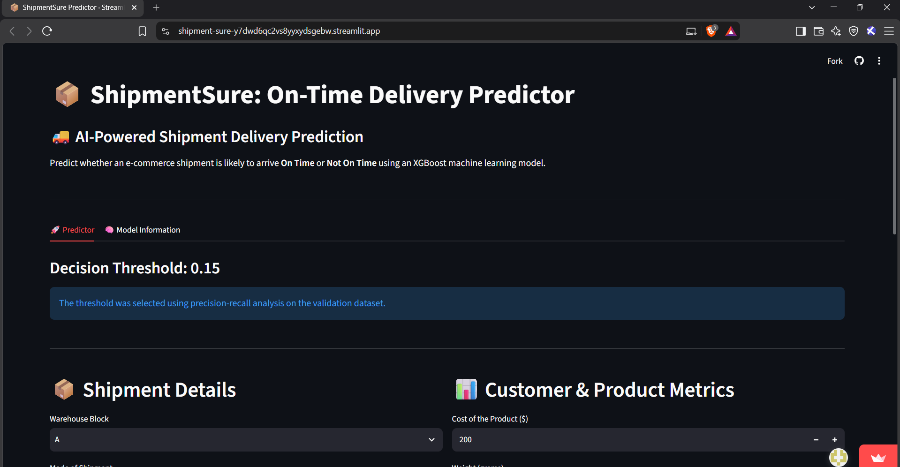
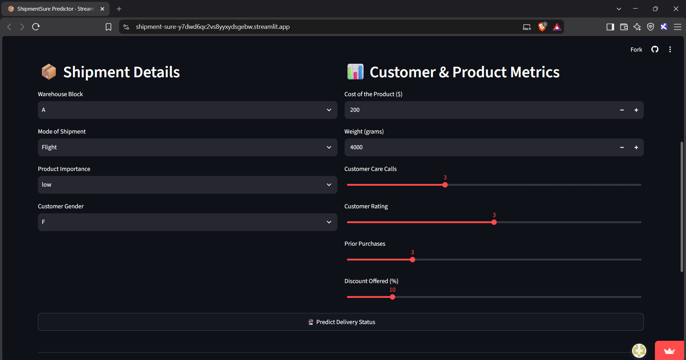
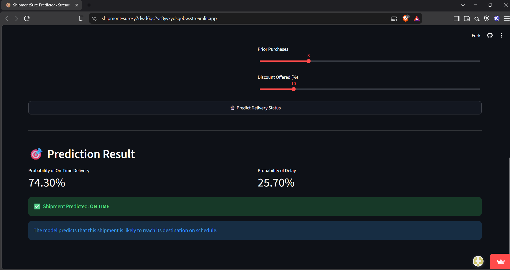
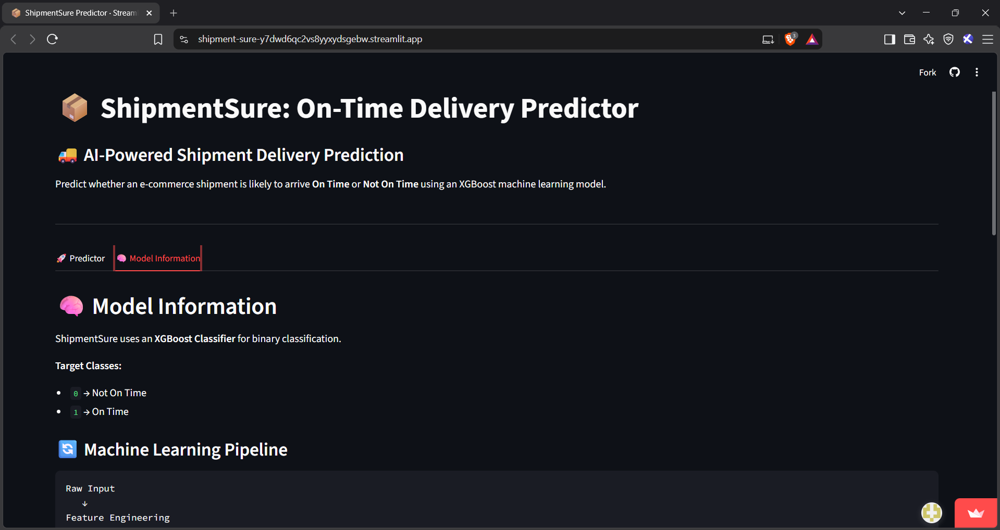

# 📦 ShipmentSure: On-Time Delivery Predictor

An AI-powered machine learning application that predicts whether e-commerce shipments will arrive on time or experience delays. Built with **XGBoost**, **scikit-learn**, and **Streamlit** for real-time predictions.

## 🎯 Overview

ShipmentSure addresses a critical challenge in e-commerce logistics: predicting shipment delays before they happen. By analyzing shipment characteristics (warehouse location, shipping mode, customer data, and product metrics), the model can forecast delivery status with high accuracy.

The application provides:
- **Real-time predictions** via an interactive Streamlit web interface
- **Probability scores** for both on-time and delayed deliveries
- **Optimized decision thresholds** based on precision-recall analysis
- **Feature engineering** including cost-to-weight ratios for enhanced model performance

## ✨ Key Features

- 🎯 **Binary Classification**: Predicts "On Time" vs "Not On Time" delivery status
- 🤖 **XGBoost Model**: High-performance gradient boosting classifier
- 🧪 **Feature Engineering**: Automatic handling of missing values, categorical encoding, and scaling
- 📊 **Interactive Dashboard**: User-friendly Streamlit interface with real-time predictions
- 📈 **Probability Scores**: View confidence levels for each prediction
- ⚙️ **Threshold Optimization**: Decision threshold tuned via precision-recall analysis
- 📋 **Model Metrics**: Detailed information about model performance and pipeline

## 🏗️ System Architecture

```text
User Input (Shipment Details)
           ↓
    Streamlit Interface
           ↓
Feature Engineering
           ↓
Missing Value Imputation
           ↓
Categorical Encoding
           ↓
Standard Scaling
           ↓
XGBoost Classifier
           ↓
Probability Output
           ↓
Decision Threshold
           ↓
Prediction (On Time / Not On Time)
```

## 📋 Input Features

The model accepts the following shipment and customer information:

| Feature | Type | Example Values |
|---------|------|-----------------|
| **Warehouse Block** | Categorical | A, B, C, D, E, F |
| **Mode of Shipment** | Categorical | Flight, Road, Ship |
| **Product Importance** | Categorical | Low, Medium, High |
| **Customer Gender** | Categorical | M, F |
| **Cost of Product** | Numeric | $10 - $500 |
| **Weight (grams)** | Numeric | 100 - 8000 |
| **Customer Care Calls** | Numeric | 1 - 7 |
| **Customer Rating** | Numeric | 1 - 5 |
| **Prior Purchases** | Numeric | 1 - 10 |
| **Discount Offered (%)** | Numeric | 0 - 65 |

## 🚀 Quick Start

### Prerequisites
- Python 3.8+
- pip or conda

### Installation

1. **Clone the repository**
   ```bash
   git clone <repository-url>
   cd Shipment-Sure
   ```

2. **Create a virtual environment** (recommended)
   ```bash
   python -m venv venv
   source venv/bin/activate  # On Windows: venv\Scripts\activate
   ```

3. **Install dependencies**
   ```bash
   pip install -r requirements.txt
   ```

4. **Ensure model files are present**
   - `shipment_xgboost_pipeline.pkl` - Pre-trained XGBoost pipeline
   - `decision_threshold.pkl` - Optimized decision threshold

### Running the Application

```bash
streamlit run app.py
```

The application will open in your default browser at `http://localhost:8501`

## 📊 Model Details

- **Algorithm**: XGBoost Classifier
- **Target Classes**: 
  - `0` → Not On Time (Delayed)
  - `1` → On Time (Delivered on schedule)
- **Pipeline Components**:
  - Missing value imputation
  - One-hot encoding for categorical features
  - Standard scaling for numerical features
  - Gradient boosting classification

## 📁 Project Structure

```
Shipment-Sure/
├── app.py                              # Main Streamlit application
├── requirements.txt                    # Python dependencies
├── dataset.csv                         # Training dataset
├── Shipmentt_model_training.ipynb      # Model training notebook
├── shipment_xgboost_pipeline.pkl       # Pre-trained model (not in repo)
├── decision_threshold.pkl              # Optimized threshold (not in repo)
├── catboost_info/                      # CatBoost training artifacts
│   ├── catboost_training.json
│   ├── learn_error.tsv
│   ├── time_left.tsv
│   └── learn/
├── README.md                           # This file
└── .gitignore                          # Git ignore rules
```

## 📦 Dependencies

Core dependencies (see `requirements.txt` for full list):

- **streamlit** - Web interface framework
- **pandas** - Data manipulation
- **scikit-learn** - ML pipeline and preprocessing
- **xgboost** - Gradient boosting classifier
- **joblib** - Model serialization
- **numpy** - Numerical computations
- **lightgbm** - Alternative gradient boosting
- **catboost** - Alternative gradient boosting
- **imbalanced-learn** - Handling imbalanced datasets
- **matplotlib & seaborn** - Visualization

## 🔍 Model Training

The model was trained on e-commerce shipment data using the Jupyter notebook `Shipmentt_model_training.ipynb`. 

To retrain the model:

1. Open `Shipmentt_model_training.ipynb` in Jupyter
2. Update the training data if needed
3. Run all cells to train and evaluate
4. Export the new model files (`shipment_xgboost_pipeline.pkl` and `decision_threshold.pkl`)

## 💡 Usage Example

### Via Streamlit Interface

1. Launch the app: `streamlit run app.py`
2. Fill in shipment details:
   - Select warehouse block and shipping mode
   - Enter product cost and weight
   - Provide customer metrics
3. Click **"🔮 Predict Delivery Status"**
4. View the prediction result and probability scores

### Programmatic Usage

```python
import joblib
import pandas as pd

# Load model and threshold
pipeline = joblib.load("shipment_xgboost_pipeline.pkl")
threshold = joblib.load("decision_threshold.pkl")

# Create sample data
data = pd.DataFrame({
    "Warehouse_block": ["A"],
    "Mode_of_Shipment": ["Flight"],
    "Customer_care_calls": [3],
    "Customer_rating": [4],
    "Cost_of_the_Product": [200],
    "Prior_purchases": [2],
    "Product_importance": ["high"],
    "Gender": ["M"],
    "Discount_offered": [10],
    "Weight_in_gms": [2500]
})

# Get prediction
probabilities = pipeline.predict_proba(data)
prediction = 1 if probabilities[0][1] >= threshold else 0
print(f"Prediction: {'On Time' if prediction == 1 else 'Not On Time'}")
print(f"Probability: {probabilities[0][1]:.2%}")
```

## � Screenshots

### Dashboard Interface



### Inputs interface



### Prediction Results




### Model Information Tab




---

**How to add screenshots:**

1. Create a `docs` folder in the project root
2. Take screenshots of your Streamlit app while running
3. Save them as PNG files in the `docs` folder:
   - `docs/dashboard.png` - Main prediction dashboard
   - `docs/results.png` - Prediction results display
   - `docs/model_info.png` - Model information tab
4. Commit and push the `docs` folder to your repository

## �📈 Model Performance

The model was optimized using precision-recall analysis on the validation dataset. The decision threshold was selected to balance false positives and false negatives based on business requirements.

